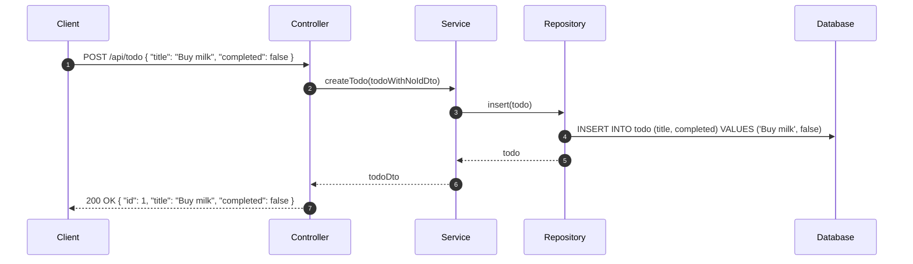

# アーキテクチャ

## シーケンス図



## シーケンス詳細

### ① クライアントがリクエストを送信

クライアントは、POST /api/todo に対して、以下の JSON をリクエストボディに含めてリクエストを送信します。

```json
{ "title": "Buy milk", "completed": false }
```

### ② コントローラがサービスのメソッドを呼び出し

コントローラは、リクエストボディを DTO に変換し、サービスの createTodo メソッドを呼び出します。

- 引数: `todoWithNoIdDto`
- 戻り値: `todoDto`


### ③ サービスがリポジトリのメソッドを呼び出し

サービスは、DTO をエンティティに変換し、リポジトリの insert メソッドを呼び出します。

- 引数: `todo`
- 戻り値: `todo`

### ④ リポジトリがデータベースにクエリを送信

リポジトリは、エンティティをデータベースに保存するためのクエリを送信します。

クエリは [マッピング定義](../src/main/resources/mapper/TodoRepository.xml) の insertを参照

### ⑤ リポジトリがエンティティを返却

リポジトリは、データベースに保存されたエンティティを返却します。

### ⑥ サービスが DTO を返却

サービスは、エンティティを DTO に変換して返却します。

### ⑦ コントローラがレスポンスを返却

コントローラは、レスポンスボディに変換された DTO を含めてレスポンスを返却します。