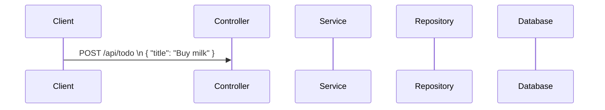

# アーキテクチャ

```mermaid
sequenceDiagram
    participant Cl as Client
    participant Ct as Controller
    participant S  as Service
    participant R  as Repository
    participant D  as Database
    
    Cl ->> Ct: POST /api/todo \n { "title": "Buy milk" }
```