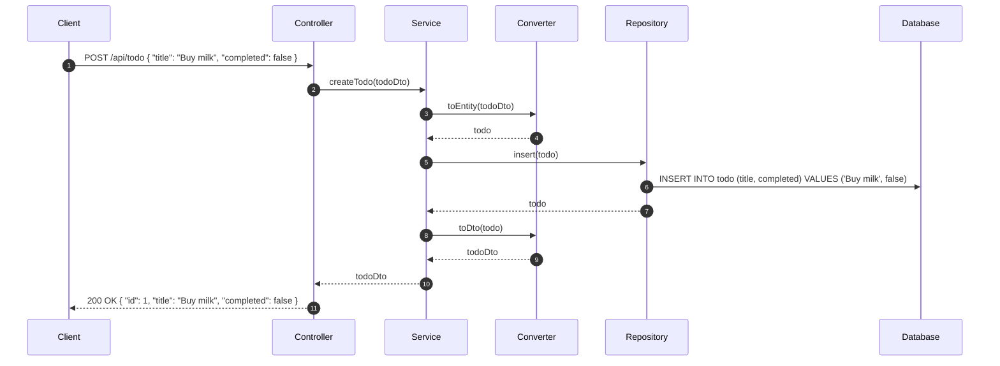

# アーキテクチャ

## シーケンス図



## シーケンス詳細

### ① クライアントがリクエストを送信

クライアントは、POST /api/todo に対して、以下の JSON をリクエストボディに含めてリクエストを送信します。

```json
{ "title": "Buy milk", "completed": false }
```

### ② コントローラがサービスのメソッドを呼び出し

コントローラは、リクエストボディを DTO に変換し、サービスの createTodo メソッドを呼び出します。

- 引数: `todoDto`


### ③、④ サービスがコンバーターでDtoをEntityに変換

- 引数： `todoDto`
- 戻り値: `todo`

### ⑤ サービスがリポジトリのメソッドを呼び出し

サービスは、リポジトリの insert メソッドを呼び出します。

- 引数: `todo`

### ⑥ リポジトリがデータベースにクエリを送信

リポジトリは、エンティティをデータベースに保存するためのクエリを送信します。

クエリは [マッピング定義](../src/main/resources/mapper/TodoRepository.xml) の insertを参照

### ⑦ リポジトリがエンティティを返却

リポジトリは、データベースに保存されたエンティティを返却します。

### ⑧、⑨ サービスがコンバーターでEntityをDtoに変換

- 引数： `todo`
- 戻り値: `todoDto`

### ⑩ コントローラがレスポンスを返却

コントローラは、レスポンスボディに変換された DTO を含めてレスポンスを返却します。